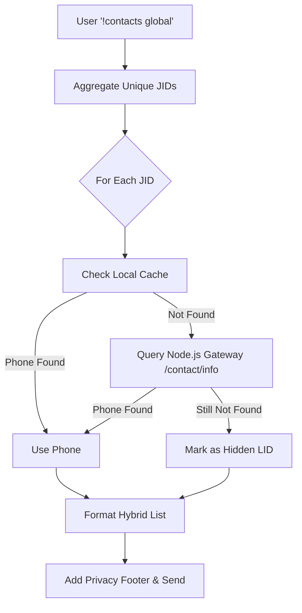

# Contact Sync Architecture & Active Resolution Flow

## Overview
The WhatsApp Casual Bot synchronizes contacts across groups and stores them both in a local SQLite Ledger (`GroupContactLedger`) and a filesystem cache (`data/contacts/`). 

Because WhatsApp's Webhooks often obfuscate users' real phone numbers into `@lid` (LID) formats due to strict privacy settings, the bot employs an **Active Resolution Strategy** to maximize phone number recovery for commands like `!contacts global`.

## Active Resolution Strategy

When an Owner executes `!contacts global`, the bot performs the following steps:

1. **Aggregation**: The bot iterates through all group profile caches (`data/contacts/*_g_us/profile.json`) and extracts a unique set of all participant JIDs (Jabber IDs).
2. **Local Cache Lookup**: The bot checks the local cache to see if the phone number was previously stored in a less restricted state.
3. **Gateway Fallback**: If the local cache only provides an `@lid`, the bot performs a live HTTP GET request to the Node.js Gateway via the `/contact/info` endpoint.
4. **Live `wwebjs` Lookup**: The Node.js Gateway calls `client.getContactById(jid)` directly against the active WhatsApp Web session, which often succeeds in retrieving the true phone number (`contact.number`).
5. **Hybrid Formatting**: The bot formats the list using real numbers where available (`+1234567890 (Name)`). If a number is completely unresolvable, it gracefully degrades to `Unknown User (LID: 12345@lid)`.
6. **Footer Summary**: The bot appends a summary footer explaining how many numbers remain hidden due to WhatsApp privacy features.

## Architecture Diagram

## Security & Permissions
- Contact synchronization runs automatically via webhooks.
- `!contacts global` and `!contacts export` are strictly **Owner Only** commands to prevent unauthorized data scraping.
