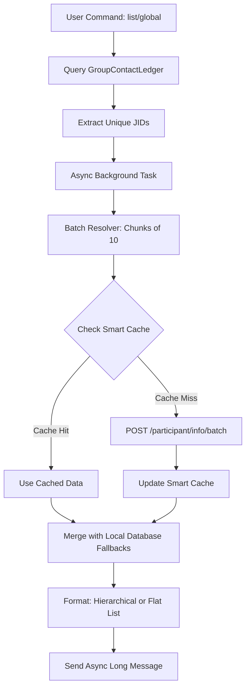

# Contact Sync Architecture & Live Resolution Flow

## Overview
The WhatsApp Casual Bot synchronizes contacts across groups and stores them in a local SQLite Ledger (`GroupContactLedger`). 

Because WhatsApp's Webhooks often obfuscate users' real phone numbers into `@lid` (LID) formats due to strict privacy settings, or because user names frequently change, the bot employs a **Live Batched Resolution Strategy**. This ensures commands like `!contacts list` and `!contacts global` deliver high-fidelity, up-to-date information without exposing the underlying gateway to rate limits.

## Core Components

1. **`GroupContactLedger` (Database)**
   - The primary source of truth for group membership.
   - Populated dynamically during background sweeps and regular message webhooks.
   - Stores `jid`, `chat_id`, `phone_number`, `push_name`, `is_active`, and timestamps.

2. **Smart Cache (`data/contact_resolution_cache.json`)**
   - A fast file-based cache with a 24-hour TTL.
   - Prevents the bot from spamming the Node.js gateway for users whose data was already resolved recently.

3. **Node.js Gateway Batched Endpoint (`POST /participant/info/batch`)**
   - Resolves JIDs into true phone numbers and names via `wwebjs`.
   - Returns strict privacy indicators if a user's settings hide their phone number.

## Command Architectures

### `!contacts list` (Group-Specific Live Resolution)
When executed within a specific group chat:
1. Validates the command is run in a group and that the sender is an Admin or Owner.
2. Queries the `GroupContactLedger` for all active members in `chat_id`.
3. Dispatches a background asynchronous task (`run_list_resolution_bg`) to process all unique JIDs.
4. JIDs are passed to `resolve_participant_info_batch()`, which chunks them into batches of 10 and queries the gateway (falling back to the Smart Cache first).
5. The result is sorted alphabetically by resolved name.
6. The bot DMs the formatted list back to the sender, applying `🔒 Hidden (Privacy)` fallbacks for unresolved numbers.

### `!contacts global` (Cross-Group Hierarchical Resolution)
When executed by the Owner:
1. Queries the `GroupContactLedger` for *all* active entries across *all* groups.
2. Deduplicates JIDs into a flat list for maximum API efficiency.
3. Dispatches `run_global_resolution_bg` which runs the batch resolver against the deduplicated list.
4. Performs an `IN` query on `ChatSettings` to fetch human-readable group names.
5. Re-associates the resolved data into a hierarchical dictionary keyed by `chat_id`.
6. Sorts groups alphabetically, and members within each group alphabetically.
7. Outputs a highly structured list with group headers (`🏷️ Group Name`) and tree-style indentation (`├─ `).

### `!contacts export` (Data Extraction)
When executed by the Owner:
1. Generates a timestamped filename (`ledger_YYYYMMDD_HHMMSS.csv`).
2. Performs a SQLAlchemy `.outerjoin()` between `GroupContactLedger` and `ChatSettings`.
3. Exports the enriched data (including the human-readable "Group Name" column) to `data/exports/groups/`.
4. Returns exact statistics on rows exported and unique groups covered.

## Architecture Diagram

## Security & Permissions
- `!contacts list` requires **Group Admin** or **Owner** privileges.
- `!contacts global` and `!contacts export` are strictly **Owner Only** commands to prevent unauthorized data scraping.
- Background asynchronous resolution ensures long-running queries do not block webhook responses or trigger timeouts.
