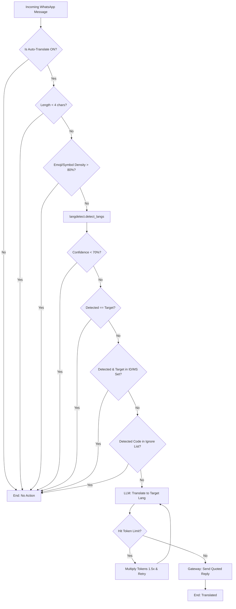

# Auto-Translation Architecture & Flow

This document summarizes the end-to-end behavior of the WhatsApp Casual Bot's auto-translation system after the latest performance and reliability refactor.

## 0. Chatty Mutual Exclusion
Before the auto-translation pipeline runs, `app/router_webhook.py` now validates whether the same incoming message was already evaluated by the Chatty engine. If Chatty touched the message at all—whether it generated a reply or simply recorded the content for future RAG context—the message is blocked from auto-translation for that webhook event.

## 1. Triggering Translation (The Fast-Path Guards)

When a message is received, the `app/router_webhook.py` processes it and checks if auto-translation is enabled for the chat. It then passes the message to `translate_text()` inside `app/translation.py`, which delegates the gatekeeping logic to `detect_language_safe(text, target_lang)`.

The fast-path sequentially checks:
1. **Length**: Is the message shorter than `TRANSLATION_MIN_LENGTH` (default: 4 chars)? If yes, skip translation. (Fixes false positives on words like "Hi", "Ok").
2. **Density**: Is the message mostly emojis, symbols, or links? (Requires > 20% alphanumeric characters). If not, skip translation.
3. **Probabilistic Detection**: Uses `langdetect.detect_langs()` to score the language.
4. **Confidence**: Is the primary language prediction confidence below `TRANSLATION_CONFIDENCE_THRESHOLD` (default: 0.70)? If yes, assume it's the target language and skip.
5. **Lexical Equivalence**: Does the detected language and target language both belong to `TRANSLATION_EQUIVALENT_LANGS` (default: `id,ms`)? If yes, treat as a match and skip.
6. **Exact Match**: Is the detected language identical to the target language? If yes, skip.

Only if ALL guards are passed does `detect_language_safe` return the detected language code. If it returns `None`, `translate_text` safely exits and returns the original text.

## 2. Ignore List Filtering

If `detect_language_safe` returns a valid code, `translate_text` then checks the chat's explicitly ignored languages (configured via `!ignore add <code>`).
- If the detected language matches a code on the ignore list, the translation is silently aborted and the original text is returned.

## 3. The LLM Translation Call

If the message requires translation, `app/translation.py:translate_text` invokes the primary Unified AI Client via `ask_llm`.
- The prompt instructs the LLM to translate strictly to the ISO 639-1 `target_lang`, preserving tone, formatting, and emojis.
- The prompt is highly concise: "Translate to {target_lang}. Auto-detect source language. Output ONLY translation with no explanations."
- **Token Exhaustion & Retries**: `ask_llm` returns a structured `LLMResponse` containing the `finish_reason`. If a high-context reasoning model exhausts the `LLM_MAX_TOKENS` limit (e.g., `finish_reason == "length"`), the system multiplies the `max_tokens_override` by 1.5x and retries the translation up to 2 times to ensure it successfully generates the output.
- A fallback error (`MSG_TRANSLATION_ERROR`) is returned if the LLM fails or is unavailable after all retries.

## 4. Delivery

The translated text is prefixed with the detected language code (e.g., `[ES] Translated text`) and sent back to the chat using the internal Node.js Gateway. The message natively replies to the exact user's message using the `quoted_participant` and `reply_to_msg_id` attributes.

## 5. Configuration Settings

The bot's translation engine is highly tunable via `.env` (which drives `app.config.Settings`):

**Global Defaults**
- `GLOBAL_AUTO_TRANSLATE`: Default ON/OFF state for new chats.
- `GLOBAL_TARGET_LANGUAGE`: Default target (e.g., `en`).
- `GLOBAL_IGNORED_LANGUAGES`: Comma-separated list of globally ignored ISO codes.

**Sensitivity Checks**
- `TRANSLATION_MIN_LENGTH`: Character threshold for detection.
- `TRANSLATION_CONFIDENCE_THRESHOLD`: Probability score required for `langdetect` to trigger the LLM.
- `TRANSLATION_EQUIVALENT_LANGS`: Comma-separated languages treated as interchangeable.

## 6. User Commands

Users can override global settings locally within any chat using:
- `!auto on|off|global`
- `!target <code>|global`
- `!ignore add|remove|list|global <code>`
- `!t <code> <text>` (Manual translation override)

## 7. Architecture & Logic Flow Diagram

Below is the logical execution flow of a message as it hits the Auto-Translation pipeline.



### ASCII Flow Representation

```text
[ Incoming Message ]
         |
         v
[ router_webhook.py ] --> (Check Chat/Global Settings)
         |
         v
[ translate_text() ]
         |
         v
[ detect_language_safe() Guard ]
         |--- (Fail: Length < 4) ---------------------> [ SKIP ]
         |--- (Fail: Mostly Emojis/Links) ------------> [ SKIP ]
         |
         v
[ langdetect.detect_langs() ]
         |
         |--- (Fail: Confidence < 70%) ---------------> [ SKIP ]
         |--- (Fail: Target == Detected) -------------> [ SKIP ]
         |--- (Fail: Both in ID/MS Equivalence Set) --> [ SKIP ]
         |
         v
[ Ignore List Check ]
         |--- (Fail: Detected lang in Ignore List) ---> [ SKIP ]
         |
         v
[ LLM Translation Call ] <-----------------------------+
         |--- Prompt: Strict tone, no filler         |
         v                                             |
[ Token Exhaustion Check ]                             |
         |--- (Fail: finish_reason == "length") ---- [ Retry with 1.5x Tokens ]
         |
         v
[ WhatsApp WebJS Gateway ]
         |--- Payload: Quoted reply with [CODE] prefix
         v
[ User Sees Translated Reply ]
```
